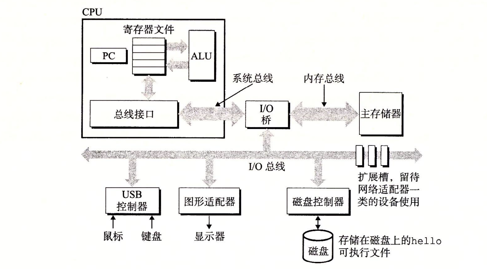
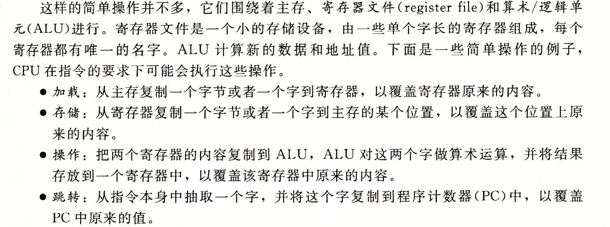

# 《深入理解计算机系统》之笔记

## 计算机系统漫游

### 1.1 信息就是比特+上下文

- 计算机系统中所有的信息——包括磁盘文件、内存中的程序与数据、网络中的数据等，这些都是由一串比特表示的。这些不同信息的数据元素必须放在对应的**上下文**里进行解释才有意义。例如，同一个字节序列，对于文本文件来说它可能表示一个字符，而对于正在内存中运行的程序来说，它则可能表示为某个CPU指令。

- 一个计算机程序从一个存储在磁盘上的**源文件**开始。源文件是一个由字节序列（8个bit为1字节）组成的文本文件。
- 由ASCII字符构成的文件称为**文本文件**，其余称**二进制文件**。

附：

- *C语言是由贝尔实验室的Dennis Ritchie于1969年～1973年创建*；
- *美国国家标准学会（American National Standards Institute, ANSI）于1989年推出了ANSI C标准，这与出自贝尔实验室的C语言已有很大的不同，尤其是函数声明的方式；*
- *国际标准化组织（International Standards Organization, ISO）于1990年推出了一个与ANSI C几乎一样的版本，称为ISO C90，随后又推出了ISO C99、ISO C11；*
- *GNU编译器套装可以基于不同的命令行选项来编译不同版本的C程序：```gcc -std=c11 hello.c```，GNU项目正在开发一个结合了ISO C11和其他一些特性的版本，可以通过命令行选项-std=gnu11来指定，今后这个版本会成为默认的版本；*

### 1.2 程序被其他程序翻译成不同的格式

- 一个高级C语言程序需要被**编译器驱动程序**转换为低级的机器语言才能被计算机执行。编译后的程序称为**可执行目标程序**，并以二进制磁盘文件的形式存放起来：```gcc -o hello hello.c```

- 一个C语言源文件翻译成可执行目标文件有四个阶段，分别如下图：

  

  关于每个阶段的更多详细解释，可以参考《深入理解计算机系统》第3页相关内容。

附：

- *GNU项目是1984年由Richard Stallman发起的一个免税的慈善项目，目标是开发出一个完整的类Unix系统。除了内核以外，GNU项目已经开发出了一个Unix系统所需要的所有主要组件（内核是由Linux项目独立发展而来）。GNU项目里包含有EMACS编辑器、GCC编译器、GDB调试器、汇编器、链接器、处理二进制文件的工具以及其他一些组件。GCC编译器已经发展到可以支持许多不同的语言，能够为许多不同的机器生成代码，支持的语言包括C、C++、Fortran、Java、Pascal、Objective-C、Ada。*

### 1.3 了解编译系统如何工作是大有益处的

### 1.4 处理器读并解释存储在内存中的指令

- shell是一个命令行解释器，它会等待一个命令行的输入，如果该命令行的第一个单词不是一个内置的shell命令，那么shell就会认为这是一个可执行文件的名字，随后它将从磁盘上加载并运行这个可执行程序。

#### 1.4.1 系统的硬件组成



- 总线是贯穿整个系统的一组电子管道，它总是传递定长的字节块，也就是**字**，现在的字大多是4字节或者8字节的。
- I/O设备是系统与外部世界的联系通道，每个I/O设备都通过一个**控制器**或者**适配器**与I/O总线相连。控制器是I/O设备本身或主板上的芯片组，而适配器则是一块插在主板插槽上的一张卡。
- 主存，也就是我们说的内存。它是一个临时存储设备，用于存储CPU正在运行的程序和数据。逻辑上看内存就是一块线性的字节数组，每个字节都有一个唯一地址，起始地址为0。
- CPU的核心是一个大小为一个字的寄存器，称为**程序计数器**（PC），在任何时刻，PC都指向内存中某条机器语言指令（也就是PC的值为该条指令的地址）。从通电开始，直到断电，CPU一直在不断的执行PC指向的指令，然后再更新PC，使其指向下一条指令，而这条指令的地址也不一定跟刚才的指令相邻。

关于CPU更多的概述看下面的截图：



#### 1.4.2 运行hello程序

第一步：shell程序从键盘上读取输入的“./hello”字符串后，将其读入到寄存器中，然后存放到内存中，之后会用这个作为相关参数来调用execve函数。


第二步：通过execve等一系列函数，运用DMA技术将磁盘上的可执行文件直接加载到内存中。


第三步：CPU开始执行内存中的机器指令，指令将“hello, world\n”字符串从主存复制到寄存器里，再从寄存器复制到显示设备，最终显示在屏幕上。


### 1.5 高速缓存至关重要

### 1.6 存储设备形成层次结构


### 1.7 操作系统管理硬件

计算机系统的分层：


操作系统有两个基本的功能：（1）防止硬件被应用程序滥用；（2）向应用程序提供一套简单一致的机制来控制硬件。操作系统通过几个基本的抽象概念（**进程、虚拟内存和文件**）来实现这两个基本功能。


附：

- *20世纪60年代是大型、复杂操作系统盛行的年代。*
- *贝尔实验室的研究员借鉴Multics系统，于1969年开始开发一个系统，在1970年命名为Unix，并于1973用C语言重写其内核，1974正式对外发布。*
- *关于Unix，20世纪70年代晚期到80年代早期有很多重要的工作：美国加州大学伯克利分校发布了Unix 4. xBSD，这个版本里出现了虚拟内存和Internet协议；贝尔实验室发布了System V Unix；Solaris系统是基于前面两个系统衍生出来的。*
- *IEEE（电气和电子工程师协会）推行了Posix标准以标准化Unix的开发，标准包括系统调用的C语言接口、shell程序、线程及网络编程等。*

#### 1.7.1 进程

**进程**是操作系统对一个正在运行的程序的一种抽象。在一个系统上可以同时运行多个进程，它们通过一种叫做**上下文切换**的机制交错执行，但每个进程都好像在独占地使用硬件。所谓上下文切换即保存当前进程的上下文，恢复新进程的上下文，然后将控制权交给新进程。

进程运行所需的状态信息就是**上下文**，这种信息包括PC和寄存器的当前值，以及主存上的内容。

进程的切换是由操作系统**内核**控制的，内核是操作系统代码常住内存的部分。**注意，内核不是一个单独的进程，相反，它是系统管理全部进程所用的代码和数据的集合**。


#### 1.7.2 线程

一个进程可以由多个称为**线程**的执行单元组成，每个线程都运行在进程的上下文中，并共享代码和全局数据。

#### 1.7.3 虚拟内存

**虚拟内存**是一个抽象概念，它为每个进程提供了一个假象，即每个进程都在独占的使用内存。每个进程看到的内存都是一样的，称为**虚拟地址空间**，下图是Linux进程的虚拟地址空间：


每个区域的解释见下图：


#### 1.7.4 文件

**文件**就是字节序列，仅此而已。每个I/O设备都可以看作是文件，应用程序可以通过一组称为Unix I/O的系统调用来读写所有的I/O设备而无需关心设备的底层实现。

附：

- *1991年8月，芬兰研究生Linus Torvalds发布了一个新的类Unix的操作系统内核，这就是后来的Linux内核。*
- *通过和GNU项目的结合，Linux项目已经发展成一个完整的、符合Posix标准的Unix操作系统版本。从手持设备到大型计算机，Linux项目取得了空前的成功。*

### 1.8 系统之间利用网络通信

## 信息的表示和处理

### 2.1 信息存储

字节是最小的可寻址的内存单位。对于机器级程序而言，内存就是一个非常大的字节数组，称为**虚拟内存**，每个字节都由一个唯一的数字来标识，称为它的地址，所有可能的地址集合称为**虚拟地址空间**。

编译器或者运行时系统会将内存划分为更可管理的单元，来存放不同的数据对象，这种管理完全是在虚拟地址空间里完成的。

#### 2.1.1 十六进制表示法

#### 2.1.2 字数据大小

32位字长限制虚拟地址空间4GB，64位字长则将虚拟地址空间扩大到16EB。

大多数64位机器也可以运行为32位机器编译的程序，这是一种向后兼容，但反之不行。一个程序是32位还是64位取决于它是如何编译的。

下图是C语言里各种数据类型的典型大小：


由于C语言数据类型的大小有些灵活，可能会因为不同的编译器编译而大小不一样，从而出现一些奇怪的问题，所以ISO C99引入了一种数据类型，它们的大小是固定的，不会随编译器或者机器而变化，例如int32_t和int64_t。

C语言里大部分数据都是编码为有符号数，除非有unsigned修饰或者声明了为无符号数。不过char类型是个例外，尽管大多数编译器都将它视为有符号数，但C标准并不保证这一点。

C语言里的类型声明也比较灵活，比如下面这几种声明都是一个意思：

- unsigned long
- unsigned long int
- long unsigned
- long unsigned int

#### 2.1.3 寻址和字节顺序

对于多字节程序对象，其地址是其所使用的字节中最小的那个字节地址。

**大端法**和**小端法**的区别在于对象地址存储的是从数据对象的高有效位开始还是低有效位开始。大多数个人电脑和手机系统采用的是小端法。

在C语言里，这两种声明方式等价：

```c
// (1)
typedef int *int_pointer;
int_pointer ip;
// ----------------------
// (2)
int *ip;
```

在C语言中，既可以用数组表示法来引用指针，也可以用指针表示法来引用数组元素。

C语言中，```void *```是一个特殊类型的指针，其没有相关联的类型信息。

**强制类型转换**能够将一种类型的变量转换成另一种。

#### 2.1.4 字符串

C语言中字符串被编码为一个以null（其值为0）结尾的字符数组。

#### 2.1.5 代码

对于机器而言，程序仅仅是字节序列而已，而二进制代码在不同的机器上是不兼容的。

#### 2.1.6 布尔代数简介


#### 2.1.7 C语言中的位运算

C语言支持按位布尔运算，运算符号就是2.1.6介绍的几种。

#### 2.1.8 C语言中的逻辑运算

逻辑运算有个特性，如果对第一个参数求值就能确定表达式的值，那么逻辑运算符就不会对第二个参数求值；例如表达式```a&&5/a```将不会造成除零错误。

#### 2.1.9 C语言中的位移运算


右移运算有两种，几乎所有的编译器对于有符号数都实行算术右移。对于无符号数，右移则必须是逻辑的。在Java中，对右移运算有明确的定义，x>>k表示将x算术右移k位，x>>>k表示将x逻辑右移k位。

### 2.2 整数表示

整数编码有两种：有符号整数和无符号整数。

#### 2.2.1 整型数据类型


附：

- *C和C++都支持有符号数（默认）和无符号数，而Java只支持有符号数*

#### 2.2.2 无符号数编码

略

#### 2.2.3 补码编码

有符号数的编码方式大致有3中，分别是**原码**、**反码**和**补码**，而补码是计算机表示有符号数的一般方式。

① 原码：
原码是指将最高位作为符号位(0表示正，1表示负)，其它数字位代表数值本身的绝对值的数字表示方式。
例如数字6 在计算机中原码表示为：00000110
其中，第一个数字0是符号位，0表示正数，0000110是数字6的二进制数据表示。
数字-6 在计算机中原码表示为：10000110
以上是在8位计算机中的原码表示，如果在32位或16位计算机中，表示方法也是一样的，只是多了几个数字0而已。
例如，在32位 计算机中数字6 的原码表示为：00000000 00000000 00000000 00000110
在16位 计算机中数字6 的原码表示为：00000000 00000110
② 反码：
反码表示规则为：如果是正数，则表示方法和原码一样；如果是负数，符号位不变，其余各位取反，则得到这个数字的反码表示形式。
例如，数字6 在8位 计算机中的反码就是它的原码：00000110
数字－6 在 8位计算机中的反码为：11111001
③ 补码
补码规则为：如果是正数，则表示方法和原码一样；如果是负数，则在该数字的反码加上1(相当于将原码数值位取反然后在最低位加1)。
例如：数字6 在8位 计算机中的补码就是它的原码：00000110
数字-6 在8 位 计算机中的补码为：11111010

#### 2.2.4 有符号数和无符号数之间的转换

对于大多数C语言实现，**处理同样字长的有符号数和无符号数之间的转换，一般规则是：数值可能会改变，但底层的位表示不变**。

#### 2.2.5 C语言中的有符号数和无符号数

C语言里整数值默认都是有符号的，想创建一个无符号常量，必须像这样：12345U或者0x1A2Bu。

C语言标准虽然没有规定有符号数和无符号数之间如何转换，但几乎所有的系统采用的都是**底层位表示不变，只改变解释这些位的方式**。

C语言的强制类型转换有两种方式，分别是显示和隐式：

```c
// 显式
int tx, ty;
unsigned ux, uy;
tx = (int) ux;
uy = (unsigned) ty;
```

```c
// 隐式
int tx, ty;
unsigned ux, uy;
tx = ux;
uy = ty;
```

#### 2.2.6 扩展一个数字的位表示

一种常见的运算是在不同字长的整数之间进行转换，同时又保持数值不变。

- 要将一个无符号数转换成一个更大的数据类型，只需简单的在它的编码前面添0即可，称为零扩展。
- 因为绝大多数有符号数都是用其补码来表示的，所以有符号数的扩展即是其补码的扩展，也很简单，在它的编码前面增加符号位即可，称为符号扩展。
- 另外一提的是，**当即要改变一个数字的有无符号和数据大小时，先要改变大小，再改变有无符号的情况，**这是C语言标准要求的。

#### 2.2.7 截断数字

顾名思义，就是将高位的数字截成低位数字。不过有一点需要注意，无符号数字的截断比较简单，丢弃高位即可；有符号数在截断后，还要注意它的符号位可能会变化。

#### 2.2.8 关于有符号数和无符号数的建议

有符号数和无符号数之间的隐式转换往往会带来不易察觉的错误，所以尽量避免使用无符号数。实际上除了C语言外，极少有语言支持无符号数。

### 2.8 整数运算

